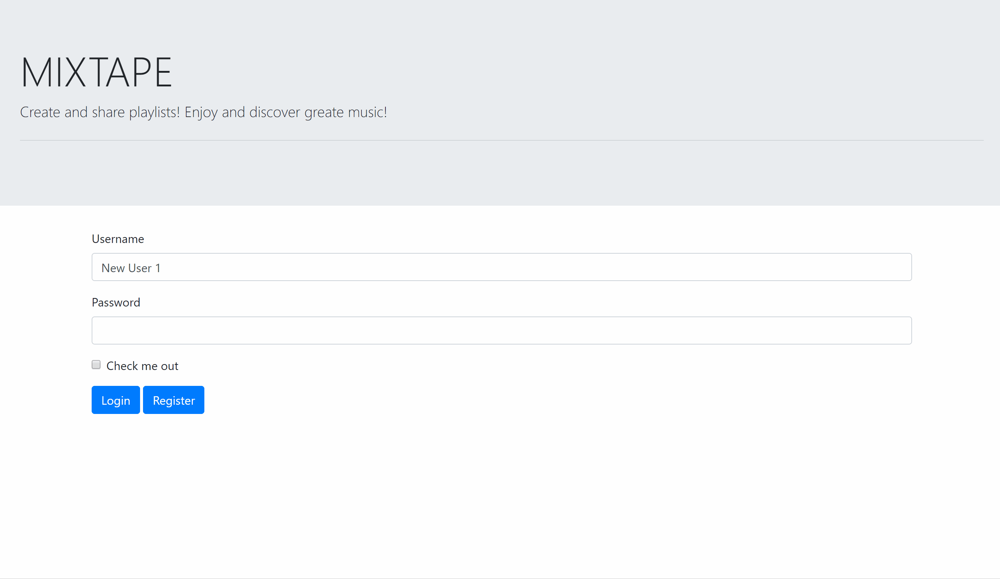

# project2
# MixTaper

MixTaper is a song playlist building and sharing platform that helps music lovers keep track of and organize all the music they are currently listening to. Users can create playlists using MixTaper’s search feature, which leverages the Spotify API to find songs. MixTaper makes it easy to add more songs to playlists and drag and drop songs to change the order of the playlist. Users can also browse other users’ playlists and subscribe to their playlists. Once subscribed, these playlists will appear on the User’s profile page for easy access.

## Getting Started
to get started with using the application, head over to the deployed website and play around. make an account, put together someplaylists, and subscribe to some that others have already made!
[Deployed site](https://peaceful-meadow-54022.herokuapp.com/)

## Built With

* [HTML](https://developer.mozilla.org/en-US/docs/Web/HTML)
* [CSS](https://developer.mozilla.org/en-US/docs/Web/CSS)
* [Bootstrap](https://getbootstrap.com/)
* [JQuery](https://jquery.com/)
* [Javascript](https://developer.mozilla.org/en-US/docs/Web/JavaScript)
* [NodeJS](https://nodejs.org/en/)
* [MySQL](https://www.mysql.com/)
* [SequelizeORM](https://sequelize.org/)
* [Passport](http://www.passportjs.org/docs/)
* [SpotifyAPI](https://developer.spotify.com/documentation/web-api/)

## Deployed Link

* [See Live Site](https://peaceful-meadow-54022.herokuapp.com/)

## Authors

* Amanda Atkins
- [Link to Portfolio Site](https://digitalrainstorm.com/)
- [Link to Github](https://github.com/amandalatkins)
- [Link to LinkedIn](https://www.linkedin.com/in/amandalatkins/)

* Dexter Valencia
- [Link to Portfolio Site](https://itsmedexter.github.io/basic-portfolio/)
- [Link to Github](https://github.com/itsmedexter)
- [Link to LinkedIn](https://www.linkedin.com/in/dextervalencia/)

* Lucas Coffee
- [Link to Portfolio Site](https://kalashnikoffee.github.io/responsive-bio/)
- [Link to Github](https://github.com/kalashnikoffee)
- [Link to LinkedIn](https://www.linkedin.com/in/lucas-coffee-08853719/)

## License

This project is licensed under the MIT License 

## Acknowledgments

Thanks again to Jerome, Kerwin, and Mahisha for their guidance.
